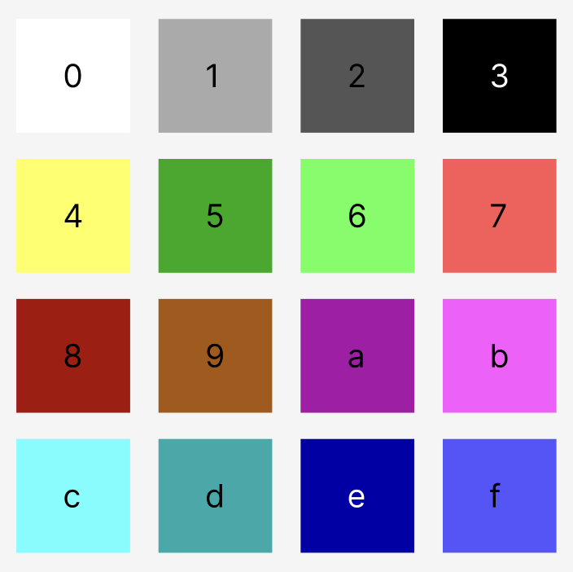

## Bit-Packed Maps on Starknet

This library is heavily inspired by kadenzipfel's bit-packed-map (https://github.com/kadenzipfel/bit-packed-map) which was originally written in solidity. The goal of this repo is to allow users to store and render svgs on chain (starknet) which little to no gas fee's involved by storing a compact bit-packed map.

#### Example

Consider the following bitmap: `0x7624778dedc75f8b322b9fa1632a610d40b85e106c7d9bf0e743a9ce291b9c63`. We can see how each 4 bit value is assigned to a square according to the above color pallet.

| **7** | **6** | **2** | **4** | **7** | **7** | **8** | **d** |
| ----- | ----- | ----- | ----- | ----- | ----- | ----- | ----- |
| **e** | **d** | **c** | **7** | **5** | **f** | **8** | **b** |
| **3** | **2** | **2** | **b** | **9** | **f** | **a** | **1** |
| **6** | **2** | **3** | **a** | **6** | **1** | **0** | **d** |
| **4** | **0** | **b** | **8** | **5** | **e** | **1** | **0** |
| **6** | **c** | **7** | **d** | **9** | **b** | **f** | **0** |
| **e** | **7** | **4** | **3** | **a** | **9** | **c** | **e** |
| **2** | **9** | **1** | **b** | **9** | **c** | **6** | **3** |

#### How

Each character in the bitmap corresponds to a single color in the color pallet. With bitwise operations, each individual pixel can be searched and rendered on an svg.

The `render_svg` function can be used to obtain an svg of the bitmap.

#### Installation

Git clone the repo and run the command `protostar test`

#### Current limitations

So far, a bitmap of an 8x8 image of 4 bit colors can be rendered with 46,536 steps used, which is way below the 1,000,000 step limit. More testing is due to be done to test its limits, feel free to contribute!
